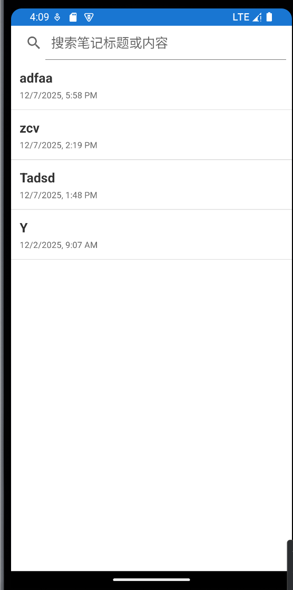
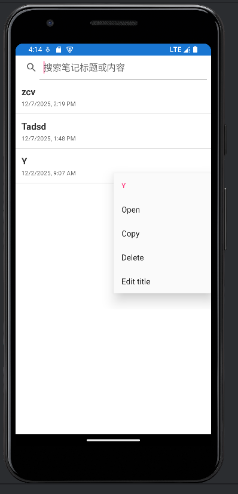
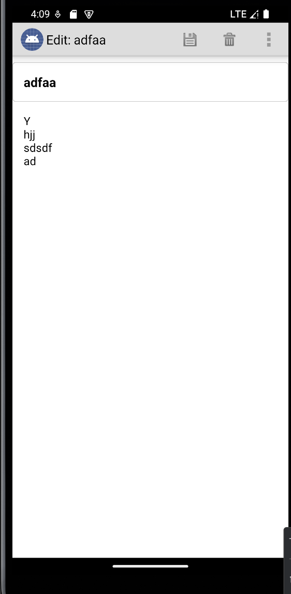
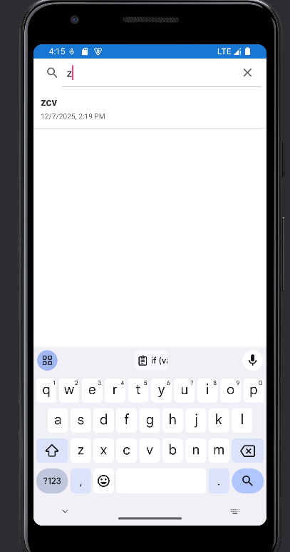

# NotePad 应用 README 文档

## 项目概述

这是一个基于 Android 的简单记事本应用，允许用户创建、查看、编辑和删除笔记。该应用是 Google 提供的 NotePad 示例项目的增强版本，具有现代化的界面设计和扩展功能。

## 主要功能

### 基础功能
- 创建新笔记
- 查看笔记列表
- 编辑现有笔记
- 删除笔记
- 复制和粘贴笔记内容

### 扩展功能
- 笔记标题支持
- 现代化 UI 设计
- 卡片式布局显示
- 时间戳显示
- 自定义主题颜色

## 技术架构

### 核心组件

#### Activities
- [NotesList](file://C:\Users\lenovo\Desktop\NotePad-main\NotePad-main\app\src\main\java\com\example\android\notepad\NotesList.java#L54-L545): 显示笔记列表的主要界面
- [NoteEditor](file://C:\Users\lenovo\Desktop\NotePad-main\NotePad-main\app\src\main\java\com\example\android\notepad\NoteEditor.java#L53-L627): 编辑笔记内容的界面
- [TitleEditor](file://C:\Users\lenovo\Desktop\NotePad-main\NotePad-main\app\src\main\java\com\example\android\notepad\TitleEditor.java#L37-L145): 编辑笔记标题的界面
- [NotesLiveFolder](file://C:\Users\lenovo\Desktop\NotePad-main\NotePad-main\app\src\main\java\com\example\android\notepad\NotesLiveFolder.java#L36-L112): 支持 Live Folder 功能

#### Content Provider
- [NotePadProvider](file://C:\Users\lenovo\Desktop\NotePad-main\NotePad-main\app\src\main\java\com\example\android\notepad\NotePadProvider.java#L53-L804): 管理笔记数据的 Content Provider

#### 数据模型
- [NotePad](file://C:\Users\lenovo\Desktop\NotePad-main\NotePad-main\app\src\main\java\com\example\android\notepad\NotePad.java#L27-L161): 定义了应用的数据契约，包括笔记表结构和 URI 规范
- [Categories](file://C:\Users\lenovo\Desktop\NotePad-main\NotePad-main\app\src\main\java\com\example\android\notepad\Categories.java#L5-L14): 分类功能相关（预留）

### 数据库结构

主要数据表为 `notes` 表，包含以下字段：

| 字段 | 类型 | 描述 |
|------|------|------|
| `_id` | INTEGER | 主键，自增 |
| [title](file://C:\Users\lenovo\Desktop\NotePad-main\NotePad-main\app\src\androidTest\java\com\example\android\notepad\NotePadProviderTest.java#L794-L794) | TEXT | 笔记标题 |
| [note](file://C:\Users\lenovo\Desktop\NotePad-main\NotePad-main\app\src\androidTest\java\com\example\android\notepad\NotePadProviderTest.java#L795-L795) | TEXT | 笔记内容 |
| `created` | INTEGER | 创建时间戳 |
| `modified` | INTEGER | 修改时间戳 |

## UI 设计

### 颜色主题
应用采用 Material Design 风格的颜色方案：

```xml
<color name="colorPrimary">#2196F3</color>
<color name="colorPrimaryDark">#1976D2</color>
<color name="colorAccent">#FF4081</color>
<color name="textPrimary">#333333</color>
<color name="textSecondary">#666666</color>
<color name="divider">#EEEEEE</color>
<color name="background">#FFFFFF</color>
```


### 布局文件
- [activity_notes_list.xml](file://C:\Users\lenovo\Desktop\NotePad-main\NotePad-main\app\src\main\res\layout\activity_notes_list.xml): 主笔记列表界面
- [note_editor.xml](file://C:\Users\lenovo\Desktop\NotePad-main\NotePad-main\app\src\main\res\layout\note_editor.xml): 笔记编辑界面，包含标题和内容输入框
- [noteslist_item.xml](file://C:\Users\lenovo\Desktop\NotePad-main\NotePad-main\app\src\main\res\layout\noteslist_item.xml): 列表项显示样式
- [title_editor.xml](file://C:\Users\lenovo\Desktop\NotePad-main\NotePad-main\app\src\main\res\layout\title_editor.xml): 标题编辑对话框

## 使用说明

### 创建笔记
1. 在主界面点击 "New note" 菜单按钮
2. 输入笔记标题和内容
3. 点击返回或保存按钮自动保存

### 编辑笔记
1. 在主界面点击任意笔记项进入编辑模式
2. 修改标题或内容
3. 点击返回或保存按钮自动保存

### 删除笔记
1. 长按要删除的笔记项
2. 在弹出的上下文菜单中选择 "Delete"

### 复制/粘贴
- 复制：在编辑界面选择文本并使用菜单中的 "Copy" 功能
- 粘贴：在目标位置使用菜单中的 "Paste" 功能

## 权限要求

```xml
<uses-permission android:name="android.permission.READ_CONTACTS" />
```


应用需要读取联系人权限以支持部分功能。

## Content Provider 接口

应用通过 [NotePadProvider](file://C:\Users\lenovo\Desktop\NotePad-main\NotePad-main\app\src\main\java\com\example\android\notepad\NotePadProvider.java#L53-L804) 提供以下 URI 接口：

- `content://com.google.provider.NotePad/notes` - 访问所有笔记
- `content://com.google.provider.NotePad/notes/#` - 访问特定 ID 的笔记
- `content://com.google.provider.NotePad/live_folders/notes` - Live folder 接口

支持的操作包括查询、插入、更新和删除。

## 开发环境

- 最低 SDK 版本：API 11 (Android 3.0)
- 目标 SDK 版本：API 最新版
- 构建工具：Android Gradle Plugin
- 依赖库：Android Support Library (AppCompat)

## 测试

项目包含以下测试套件：
- `NotePadActivityTest`: Activity 功能测试
- `NotePadProviderTest`: Content Provider 功能测试

运行测试：
```bash
./gradlew connectedAndroidTest
```


## 自定义与扩展

### 添加新功能建议

1. **分类功能**：
    - 利用现有的 `Categories` 类实现笔记分类管理

2. **搜索功能**：
    - 可基于 `SearchView` 实现笔记搜索功能


### 主题定制

修改 `res/values/colors.xml` 文件中的颜色值可以轻松更换应用主题配色。

## 注意事项

1. 应用使用 `managedQuery()` 方法，在较新的 Android 版本中建议替换为 `CursorLoader`
2. 当前实现没有加密功能，敏感信息需自行考虑安全措施
3. 应用数据存储在本地数据库中，卸载应用会导致数据丢失

## 许可证

本项目基于 Apache License 2.0 开源许可，请参阅 LICENSE 文件了解详细信息。

##截图



